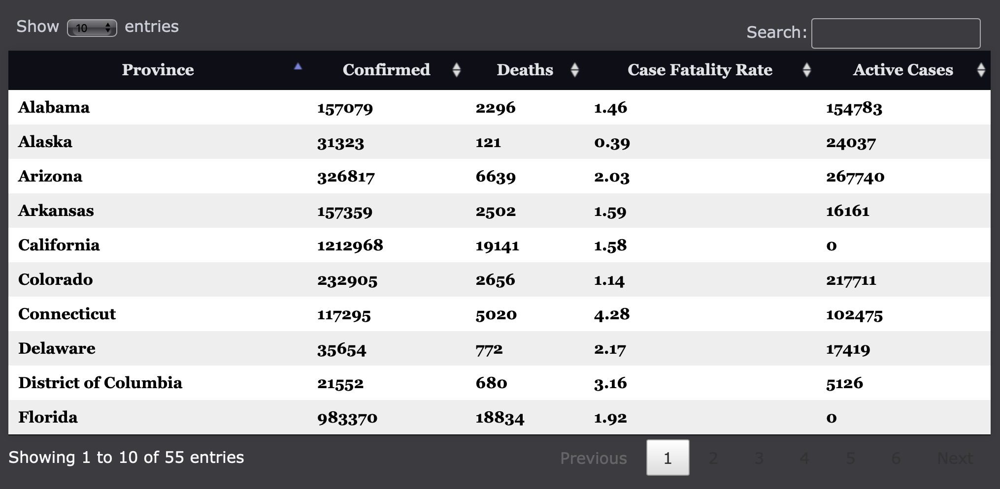
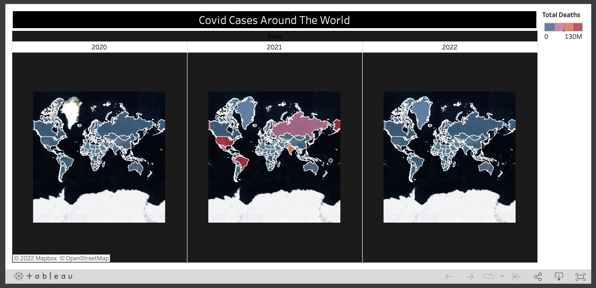

---

This is the code to my website that shows real time information on Covid-19 cases and news.
[Visit Website](https://covidupdates.co)

The API used in this project can be found through [https://rapidapi.com/vaccovidlive-vaccovidlive-default/api/vaccovid-coronavirus-vaccine-and-treatment-tracker/](https://rapidapi.com/vaccovidlive-vaccovidlive-default/api/vaccovid-coronavirus-vaccine-and-treatment-tracker/)

I utilized DataTables plug-in for jQuery to populate table with information given by the API.
This plug-in makes it so the table can be instantly searched through along with other features.

[DataTable Plug-in Documentation](https://datatables.net)

In addition, created visualization through Tableau Public to represent covid-19 cases across 3 years.

[Get Started on your Visualization for free with Tableau Public](https://public.tableau.com/en-us/s/)

